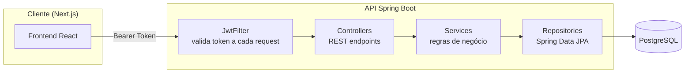
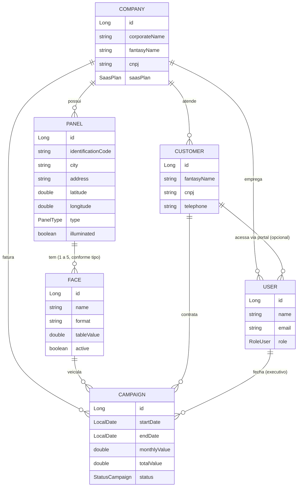

<div align="center">

# Setdoor — SaasOOH Backend

**API REST multi-tenant para gestão de inventário publicitário Out-of-Home (OOH)**

Da cotação de painel à análise de MRR: o backend que sustenta o ciclo comercial completo de uma empresa de mídia exterior.

[](https://www.oracle.com/java/)
[](https://spring.io/projects/spring-boot)
[](https://spring.io/projects/spring-security)
[](https://www.postgresql.org/)
[](https://maven.apache.org/)

[Frontend (Next.js)](https://github.com/leonardondornelles/saasooh-frontend) · [Funcionalidades](#funcionalidades) · [Endpoints](#endpoints-da-api) · [Como rodar](#como-rodar-localmente)

</div>

---

## Sobre o projeto

**Setdoor** (nome interno do código: `NeuralFlux` / `SaasOOH`) é uma plataforma SaaS B2B para empresas de mídia Out-of-Home (outdoors, front lights, triedros, LEDs, painéis de rodovia) gerenciarem seu inventário de painéis, campanhas de clientes e performance comercial em um único lugar.

O projeto nasceu de um problema real: empresas de mídia externa controlam painéis, faces e contratos em planilhas. O Setdoor foi construído para resolver isso de forma consistente, com multi-tenancy para atender várias empresas do setor, controle de ocupação por face de painel, funil comercial e um dashboard financeiro com MRR, ranking de executivos e ocupação por praça.

Este repositório contém a API REST, construída em Java + Spring Boot. O frontend (Next.js/React) consome esta API e está em um [repositório separado](https://github.com/leonardondornelles/saasooh-frontend).

---

## Arquitetura

Arquitetura em camadas clássica do Spring Boot, com autenticação stateless via JWT e isolamento de dados por tenant (empresa) em todas as consultas.



**Decisões de design:**
- **Stateless JWT** — sem sessão em memória; o token carrega `companyId`, `role` e (quando aplicável) `customerId` como claims, evitando idas extras ao banco só para checar contexto do tenant.
- **Multi-tenancy por `companyId`** — cada `Service`/`Repository` filtra explicitamente por `companyId`, garantindo isolamento de dados entre empresas clientes do SaaS.
- **DTOs em todas as bordas** — nenhuma entidade JPA é exposta diretamente na API, evitando vazamento de dados e problemas de serialização em relacionamentos bidirecionais.
- **Rotina agendada (`@Scheduled`)** — o ciclo de vida das campanhas (reservado → ativo → finalizado) é atualizado automaticamente à meia-noite e também na subida do servidor.

---

## Modelo de dados



---

## Funcionalidades

### Autenticação e multi-tenancy
- Registro de um novo tenant (empresa + usuário administrador) em uma única transação
- Login com geração de JWT (24h de validade) contendo `companyId`, `role` e `customerId` como claims
- Filtro JWT (`OncePerRequestFilter`) aplicado a todas as rotas protegidas
- Controle de acesso por papel (`RoleUser`): `SUPER_ADMIN`, `ADMIN`, `COMERCIAL`, `OPERATIONAL`, `FINANCIAL`, `CUSTOMER`
- Senhas com hash BCrypt

### Gestão de painéis e faces
- Cadastro de painéis com geolocalização (lat/long), cidade, tipo e iluminação
- Ao criar um painel, as faces são geradas automaticamente de acordo com o tipo:

| Tipo | Faces geradas |
|---|:---:|
| OUTDOOR | 2 |
| FRONT_LIGHT | 2 |
| TRIEDRO | 3 |
| LED | 5 |
| EMPENA | 1 |
| RODOVIARIO | 2 |

- Exclusão em soft delete: ao remover um painel, todas as suas faces e campanhas em andamento são inativadas/canceladas em cascata, preservando o histórico
- Tela de detalhes por painel com status de ocupação por face (`LIVRE`, `RESERVADO`, `OCUPADO`), calculado dinamicamente a partir das campanhas vigentes

### Campanhas e funil comercial
- Vínculo entre cliente, face, executivo responsável e empresa
- Prevenção de overbooking: uma nova campanha só é criada se não houver sobreposição de datas com outra campanha `ACTIVE`/`RESERVED` na mesma face
- Máquina de estados com 8 status: `PROPOSAL → NEGOTIATION → APPROVED → RESERVED → ACTIVE → COMPLETED` (+ `LOST` e `CANCELLED`)
- Guarda de regra de negócio: impede retroceder uma campanha já `ACTIVE`/`RESERVED`/`COMPLETED` de volta para fases de negociação
- Job agendado (`@Scheduled`, executado à meia-noite e no boot da aplicação) que promove campanhas automaticamente: `RESERVED/APPROVED → ACTIVE` quando a data de início chega, e `ACTIVE → COMPLETED` quando a data de término passa

### Dashboard financeiro e analytics
Endpoint dedicado (`/api/finance/dashboard`) que agrega, em uma única chamada:
- MRR (receita recorrente mensal) e ARR (projeção anual) calculados a partir das campanhas ativas
- Ticket médio por campanha ativa
- Ranking de executivos por volume de vendas (query JPQL com `GROUP BY`)
- Contratos a vencer nos próximos 30 dias, com nível de urgência (`urgent` / `soon` / `ok`) calculado por dias restantes
- Funil de pipeline (propostas → negociação → aprovados) com contagem por estágio
- Ocupação por praça/cidade, calculada como percentual de faces ocupadas sobre o total de faces ativas
- Série de evolução de faturamento para o gráfico de tendência

### Clientes e equipe
- CRUD de clientes (anunciantes) com validação de CNPJ único por empresa
- Perfil de cliente com receita total, ticket médio, total de campanhas e campanhas ativas, calculado sob demanda
- Cadastro de colaboradores (equipe interna) e de usuários do portal do cliente (disponível a partir do plano PRO)
- Relatório de performance individual por executivo: MRR gerado, campanhas ativas e histórico completo

### Planos SaaS
Cada empresa opera sob um plano que limita funcionalidades — os limites são validados no backend, não só na UI:

| Plano | Limite de painéis | Alertas | Portal do cliente | Propostas em PDF |
|---|:---:|:---:|:---:|:---:|
| BASIC | Até 50 | Não | Não | Não |
| PRO | Até 300 | Sim | Sim | Sim |
| ENTERPRISE | Ilimitado | Sim | Sim (white-label) | Sim |

---

## Stack tecnológica

| Camada | Tecnologia |
|---|---|
| Linguagem | Java 21 |
| Framework | Spring Boot 3.4.3 |
| Segurança | Spring Security + JWT (`jjwt` 0.11.5) + BCrypt |
| Persistência | Spring Data JPA / Hibernate |
| Banco de dados | PostgreSQL |
| Validação | Bean Validation (`jakarta.validation`) |
| Boilerplate | Lombok |
| Build | Maven |
| Testes | JUnit 5 + Spring Boot Test + Spring Security Test |

---

## Estrutura do projeto

```
src/main/java/com/neuralFlux/Saas_OOH_demo/
├── controllers/     # Endpoints REST (Auth, Panel, Face, Campaign, Customer, User, Company, Finance)
├── services/        # Regras de negócio, validações e agregações
├── repositories/     # Interfaces Spring Data JPA + queries JPQL customizadas
├── models/           # Entidades JPA (Company, User, Panel, Face, Customer, Campaign)
├── dtos/              # Objetos de transferência de dados (por módulo: campaignDTO, financeDTO, loginDTO...)
├── enums/            # PanelType, FaceStatus, RoleUser, SaasPlan, StatusCampaign
├── security/         # JwtFilter, SecurityConfig, UserDetailsImpl, CustomUserDetailsService
└── exceptions/       # GlobalExceptionHandler (@RestControllerAdvice), ResourceNotFoundException
```

---

## Endpoints da API

Todas as rotas, exceto as marcadas como públicas, exigem o header:
```
Authorization: Bearer <token>
```

#### Autenticação
| Método | Rota | Descrição | Acesso |
|---|---|---|---|
| POST | `/api/auth/register` | Cria um novo tenant (empresa + admin) | Público |
| POST | `/api/auth/login` | Autentica e retorna o JWT | Público |

#### Empresas e usuários
| Método | Rota | Descrição |
|---|---|---|
| GET | `/api/users/me` | Dados do usuário autenticado |
| GET | `/api/users/company/metrics` | MRR total, painéis usados vs. limite do plano |
| POST | `/api/users/employee` | Cadastra um colaborador interno |
| GET | `/api/users/company` | Lista colaboradores da empresa |
| POST | `/api/users/customer` | Cria acesso ao portal para um cliente (planos PRO+) |
| GET | `/api/users/{id}/performance` | Performance comercial de um executivo |
| POST | `/api/companies` | Cria uma empresa |
| GET | `/api/companies` | Lista empresas cadastradas |

#### Painéis e faces
| Método | Rota | Descrição |
|---|---|---|
| POST | `/api/panels` | Cria um painel (faces geradas automaticamente) |
| GET | `/api/panels` | Lista painéis ativos da empresa |
| GET | `/api/panels/{id}` | Detalhes do painel com status de cada face |
| DELETE | `/api/panels/{id}` | Remove o painel (soft delete em cascata) |
| POST | `/api/panels/{panelId}/faces` | Adiciona uma face a um painel |
| GET | `/api/panels/{panelId}/faces` | Lista as faces de um painel |

#### Campanhas
| Método | Rota | Descrição |
|---|---|---|
| POST | `/api/campaigns` | Cria uma campanha (com checagem de overbooking) |
| GET | `/api/campaigns` | Lista campanhas da empresa, mais recentes primeiro |
| PUT | `/api/campaigns/{id}/status` | Atualiza status/datas/observações de uma campanha |

#### Clientes
| Método | Rota | Descrição |
|---|---|---|
| POST | `/api/customers` | Cadastra um cliente/anunciante |
| GET | `/api/customers` | Lista clientes ativos |
| GET | `/api/customers/{id}/profile` | Perfil consolidado (receita, ticket médio, histórico) |

#### Financeiro
| Método | Rota | Descrição |
|---|---|---|
| GET | `/api/finance/dashboard` | Dashboard completo: MRR, ARR, ranking, pipeline, ocupação, vencimentos |

---

## Segurança

- Stateless JWT: `SessionCreationPolicy.STATELESS`, sem estado de sessão no servidor
- Claims do token: `sub` (email), `companyId`, `role` e `customerId` (quando aplicável)
- Autorização por papel via `ROLE_<RoleUser>` (`SUPER_ADMIN`, `ADMIN`, `COMERCIAL`, `OPERATIONAL`, `FINANCIAL`, `CUSTOMER`)
- Isolamento de tenant reforçado em nível de serviço: toda consulta/gravação sensível valida `companyId` do usuário autenticado contra o recurso acessado
- Senhas com `BCryptPasswordEncoder`
- CORS configurado explicitamente para o domínio do frontend
- Tratamento de erros centralizado via `@RestControllerAdvice`, retornando payloads JSON padronizados (timestamp, status, error, message)

> O `application.properties` deste repositório é um arquivo de configuração local de desenvolvimento. Em produção, credenciais e segredo do JWT devem vir de variáveis de ambiente — nunca comitados no código.

---

## Como rodar localmente

### Pré-requisitos
- Java 21+
- Maven 3.9+
- PostgreSQL rodando localmente

### 1. Clone o repositório
```bash
git clone https://github.com/leonardondornelles/saasooh-backend.git
cd saasooh-backend
```

### 2. Configure o banco de dados

Crie um banco no PostgreSQL e configure as credenciais via variáveis de ambiente (recomendado) ou diretamente em `src/main/resources/application.properties`:

```properties
spring.datasource.url=jdbc:postgresql://localhost:5432/saasooh
spring.datasource.username=${DB_USERNAME}
spring.datasource.password=${DB_PASSWORD}
spring.jpa.hibernate.ddl-auto=update

jwt.secret=${JWT_SECRET}
```

### 3. Execute

```bash
./mvnw spring-boot:run
```

A API estará disponível em `http://localhost:8080`.

---

## Roadmap

- [ ] Cobertura de testes unitários e de integração para services e controllers
- [ ] Refresh tokens e expiração configurável do JWT
- [ ] Geração de propostas comerciais em PDF (plano PRO/ENTERPRISE)
- [ ] Módulo de faturamento/inadimplência (o DTO `DelinquentClientDTO` já existe, aguardando implementação)
- [ ] Documentação interativa com OpenAPI/Swagger
- [ ] Rate limiting nas rotas públicas de autenticação

---

## Autor

**Leonardo Noronha Dornelles**
Estudante de Ciência da Computação (PUCRS) · Bolsista de Iniciação Científica no laboratório DaVInt (pesquisa em detecção de bots com IA)

[GitHub](https://github.com/leonardondornelles)
