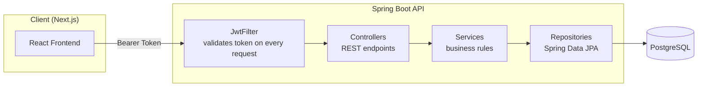
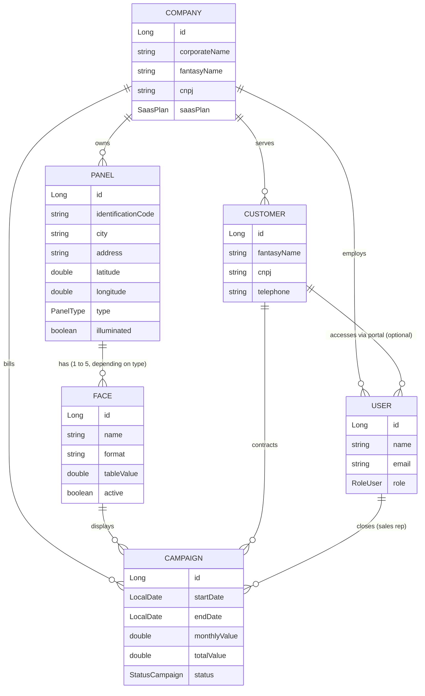

<div align="center">

# Setdoor — SaasOOH Backend

**Multi-tenant REST API for Out-of-Home (OOH) advertising inventory management**

From panel quoting to MRR analytics: the backend that powers the full commercial cycle of an out-of-home media company.

[](https://www.oracle.com/java/)
[](https://spring.io/projects/spring-boot)
[](https://spring.io/projects/spring-security)
[](https://www.postgresql.org/)
[](https://maven.apache.org/)

[Frontend (Next.js)](https://github.com/leonardondornelles/saasooh-frontend) · [Features](#features) · [Endpoints](#api-endpoints) · [Getting started](#getting-started-locally)

</div>

---

## About the project

**Setdoor** (internal codename: `NeuralFlux` / `SaasOOH`) is a B2B SaaS platform for Out-of-Home media companies (billboards, front lights, tri-vision structures, LED panels, highway panels) to manage their panel inventory, customer campaigns, and commercial performance in a single place.

The project was born from a real problem: out-of-home media companies manage panels, faces, and contracts through spreadsheets. Setdoor was built to solve this properly, with multi-tenancy to serve multiple companies in the sector, occupancy control per panel face, a commercial pipeline, and a financial dashboard with MRR, executive rankings, and occupancy by city.

This repository contains the REST API, built with Java and Spring Boot. The frontend (Next.js/React) consumes this API and lives in a [separate repository](https://github.com/leonardondornelles/saasooh-frontend).

---

## Architecture

Classic layered Spring Boot architecture, with stateless JWT authentication and tenant (company) data isolation enforced across all queries.



**Design decisions:**
- **Stateless JWT** — no in-memory session; the token carries `companyId`, `role`, and (when applicable) `customerId` as claims, avoiding extra database round-trips just to resolve tenant context.
- **Multi-tenancy by `companyId`** — every `Service`/`Repository` filters explicitly by `companyId`, ensuring data isolation between SaaS customer companies.
- **DTOs at every boundary** — no JPA entity is exposed directly through the API, preventing data leakage and serialization issues in bidirectional relationships.
- **Scheduled job (`@Scheduled`)** — the campaign lifecycle (reserved → active → completed) is updated automatically at midnight and also on server startup.

---

## Data model



---

## Features

### Authentication and multi-tenancy
- New tenant registration (company + admin user) in a single transaction
- Login with JWT generation (24h validity) carrying `companyId`, `role`, and `customerId` as claims
- JWT filter (`OncePerRequestFilter`) applied to all protected routes
- Role-based access control (`RoleUser`): `SUPER_ADMIN`, `ADMIN`, `COMERCIAL`, `OPERATIONAL`, `FINANCIAL`, `CUSTOMER`
- Passwords hashed with BCrypt

### Panel and face management
- Panel registration with geolocation (lat/long), city, type, and illumination
- When a panel is created, its faces are generated automatically based on type:

| Type | Faces generated |
|---|:---:|
| OUTDOOR | 2 |
| FRONT_LIGHT | 2 |
| TRIEDRO | 3 |
| LED | 5 |
| EMPENA | 1 |
| RODOVIARIO | 2 |

- Soft delete: removing a panel cascades to inactivate its faces and cancel any in-progress campaigns, preserving historical data
- Panel detail view showing per-face occupancy status (`FREE`, `RESERVED`, `OCCUPIED`), calculated dynamically from active campaigns

### Campaigns and sales pipeline
- Links between customer, face, responsible sales rep, and company
- Overbooking prevention: a new campaign can only be created if there is no date overlap with another `ACTIVE`/`RESERVED` campaign on the same face
- 8-status state machine: `PROPOSAL → NEGOTIATION → APPROVED → RESERVED → ACTIVE → COMPLETED` (plus `LOST` and `CANCELLED`)
- Business rule guard: prevents a campaign already `ACTIVE`/`RESERVED`/`COMPLETED` from being moved back to negotiation stages
- Scheduled job (`@Scheduled`, run at midnight and on application boot) that automatically advances campaigns: `RESERVED/APPROVED → ACTIVE` once the start date arrives, and `ACTIVE → COMPLETED` once the end date has passed

### Financial dashboard and analytics
Dedicated endpoint (`/api/finance/dashboard`) that aggregates, in a single call:
- MRR (monthly recurring revenue) and ARR (annual projection) calculated from active campaigns
- Average ticket per active campaign
- Sales rep ranking by revenue volume (JPQL query with `GROUP BY`)
- Contracts expiring in the next 30 days, with urgency level (`urgent` / `soon` / `ok`) based on days remaining
- Sales pipeline funnel (proposals → negotiation → approved) with counts per stage
- Occupancy by city, calculated as the percentage of occupied faces out of total active faces
- Revenue evolution series for trend charting

### Customers and team
- Customer (advertiser) CRUD with unique CNPJ validation per company
- Customer profile with total revenue, average ticket, total campaigns, and active campaigns, computed on demand
- Internal team member registration and customer portal user registration (available from the PRO plan onward)
- Individual sales rep performance report: MRR generated, active campaigns, and full history

### SaaS plans
Each company operates under a plan that limits functionality — limits are validated in the backend, not just the UI:

| Plan | Panel limit | Alerts | Customer portal | PDF proposals |
|---|:---:|:---:|:---:|:---:|
| BASIC | Up to 50 | No | No | No |
| PRO | Up to 300 | Yes | Yes | Yes |
| ENTERPRISE | Unlimited | Yes | Yes (white-label) | Yes |

---

## Tech stack

| Layer | Technology |
|---|---|
| Language | Java 21 |
| Framework | Spring Boot 3.4.3 |
| Security | Spring Security + JWT (`jjwt` 0.11.5) + BCrypt |
| Persistence | Spring Data JPA / Hibernate |
| Database | PostgreSQL |
| Validation | Bean Validation (`jakarta.validation`) |
| Boilerplate | Lombok |
| Build | Maven |
| Testing | JUnit 5 + Spring Boot Test + Spring Security Test |

---

## Project structure

```
src/main/java/com/neuralFlux/Saas_OOH_demo/
├── controllers/     # REST endpoints (Auth, Panel, Face, Campaign, Customer, User, Company, Finance)
├── services/        # Business rules, validations, and aggregations
├── repositories/     # Spring Data JPA interfaces + custom JPQL queries
├── models/           # JPA entities (Company, User, Panel, Face, Customer, Campaign)
├── dtos/              # Data transfer objects (by module: campaignDTO, financeDTO, loginDTO...)
├── enums/            # PanelType, FaceStatus, RoleUser, SaasPlan, StatusCampaign
├── security/         # JwtFilter, SecurityConfig, UserDetailsImpl, CustomUserDetailsService
└── exceptions/       # GlobalExceptionHandler (@RestControllerAdvice), ResourceNotFoundException
```

---

## API endpoints

All routes, except those marked as public, require the header:
```
Authorization: Bearer <token>
```

#### Authentication
| Method | Route | Description | Access |
|---|---|---|---|
| POST | `/api/auth/register` | Creates a new tenant (company + admin) | Public |
| POST | `/api/auth/login` | Authenticates and returns the JWT | Public |

#### Companies and users
| Method | Route | Description |
|---|---|---|
| GET | `/api/users/me` | Authenticated user's data |
| GET | `/api/users/company/metrics` | Total MRR, panels used vs. plan limit |
| POST | `/api/users/employee` | Registers an internal team member |
| GET | `/api/users/company` | Lists company employees |
| POST | `/api/users/customer` | Creates portal access for a customer (PRO+ plans) |
| GET | `/api/users/{id}/performance` | Commercial performance of a sales rep |
| POST | `/api/companies` | Creates a company |
| GET | `/api/companies` | Lists registered companies |

#### Panels and faces
| Method | Route | Description |
|---|---|---|
| POST | `/api/panels` | Creates a panel (faces generated automatically) |
| GET | `/api/panels` | Lists the company's active panels |
| GET | `/api/panels/{id}` | Panel details with status of each face |
| DELETE | `/api/panels/{id}` | Removes the panel (cascading soft delete) |
| POST | `/api/panels/{panelId}/faces` | Adds a face to a panel |
| GET | `/api/panels/{panelId}/faces` | Lists a panel's faces |

#### Campaigns
| Method | Route | Description |
|---|---|---|
| POST | `/api/campaigns` | Creates a campaign (with overbooking check) |
| GET | `/api/campaigns` | Lists the company's campaigns, most recent first |
| PUT | `/api/campaigns/{id}/status` | Updates status/dates/notes of a campaign |

#### Customers
| Method | Route | Description |
|---|---|---|
| POST | `/api/customers` | Registers a customer/advertiser |
| GET | `/api/customers` | Lists active customers |
| GET | `/api/customers/{id}/profile` | Consolidated profile (revenue, average ticket, history) |

#### Finance
| Method | Route | Description |
|---|---|---|
| GET | `/api/finance/dashboard` | Full dashboard: MRR, ARR, ranking, pipeline, occupancy, upcoming expirations |

---

## Security

- Stateless JWT: `SessionCreationPolicy.STATELESS`, no server-side session state
- Token claims: `sub` (email), `companyId`, `role`, and `customerId` (when applicable)
- Role-based authorization via `ROLE_<RoleUser>` (`SUPER_ADMIN`, `ADMIN`, `COMERCIAL`, `OPERATIONAL`, `FINANCIAL`, `CUSTOMER`)
- Tenant isolation enforced at the service layer: every sensitive read/write validates the authenticated user's `companyId` against the accessed resource
- Passwords hashed with `BCryptPasswordEncoder`
- CORS configured explicitly for the frontend domain
- Centralized error handling via `@RestControllerAdvice`, returning standardized JSON payloads (timestamp, status, error, message)

> The `application.properties` file in this repository is a local development configuration file. In production, credentials and the JWT secret must come from environment variables — never committed to source control.

---

## Getting started locally

### Prerequisites
- Java 21+
- Maven 3.9+
- PostgreSQL running locally

### 1. Clone the repository
```bash
git clone https://github.com/leonardondornelles/saasooh-backend.git
cd saasooh-backend
```

### 2. Configure the database

Create a PostgreSQL database and set up credentials via environment variables (recommended) or directly in `src/main/resources/application.properties`:

```properties
spring.datasource.url=jdbc:postgresql://localhost:5432/saasooh
spring.datasource.username=${DB_USERNAME}
spring.datasource.password=${DB_PASSWORD}
spring.jpa.hibernate.ddl-auto=update

jwt.secret=${JWT_SECRET}
```

### 3. Run

```bash
./mvnw spring-boot:run
```

The API will be available at `http://localhost:8080`.

---

## Roadmap

- [ ] Unit and integration test coverage for services and controllers
- [ ] Refresh tokens and configurable JWT expiration
- [ ] PDF generation for commercial proposals (PRO/ENTERPRISE plan)
- [ ] Billing/delinquency module (the `DelinquentClientDTO` already exists, pending implementation)
- [ ] Interactive documentation with OpenAPI/Swagger
- [ ] Rate limiting on public authentication routes

---

## Author

**Leonardo Noronha Dornelles**
Computer Science student (PUCRS) · Undergraduate Research Fellow at the DaVInt Lab (AI-driven bot detection research)

[GitHub](https://github.com/leonardondornelles)
